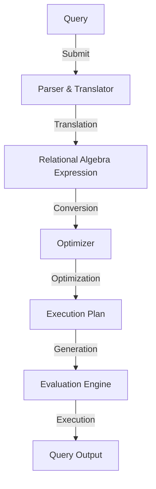

## Why DBMS?
A Database Management System (DBMS) surpasses file systems due to its robust features.
- Data Integrity
- Access control and encryption.
- Querying and indexing, data retrieval is efficient.
- Concurrent access with locking and transaction mechanisms.
- Minimizes redundancy by normalization, optimizing storage.
- It scales both vertically and horizontally, and performance tuning tools enhance efficiency.
- Built-in backup and recovery System

## Levels of Abstraction

- Physical Abstraction:
    - Describes how data is stored in DB.

- Logical Abstraction:
    - Describes the data store and relationship among data. 

- View Abstraction:
    - Hides details of data types and also for security

## Schema & Instance

**Schema** &rarr; Logical and Physical structure of Database.

**Instance** &rarr; Actual data of the tabel.

|   Name   | CustomerID | AccountNO |  MobileNo   |
|----------|------------|-----------|-------------|
| Krishanu |    123     |   901923  |  ~~9461001212~~ |
| Pavan Laha | 7628     |   917322  |  9830100291 |

## Data Models

| Language           | Use Case                                                                                                          |
|--------------------|------------------------------------------------------------------------------------------------------------------|
| DDL (Data Definition Language) | Defines and manages the structure of the database.                                                             |
| DML (Data Manipulation Language) | Manipulates and interacts with the data in the database.                                                        |
| DQL (Data Query Language) | Retrieves data from the database.                                                                               |
| DCL (Data Control Language) | Manages access control and permissions for data within the database.                                             |
| TCL (Transaction Control Language) | Manages transactions within the database.                                                                         |
| SQL (Structured Query Language) | Universal language for interacting with relational databases.

## Query Processing

## Keys

| Key Type               | Description                                                                                                                                                                          |
|------------------------|--------------------------------------------------------------------------------------------------------------------------------------------------------------------------------------|
| **Primary Key (PK)**   | Uniquely identifies each record in a table. It must contain unique values and cannot have NULL values. A table can have only one primary key.                                 |
| **Foreign Key (FK)**   | Establishes relationships between tables. It refers to the primary key of another table and helps maintain referential integrity.                                              |
| **Unique Key**         | Similar to a primary key, it ensures that each value in a column is unique. However, it can allow NULL values. A table can have multiple unique keys.                         |
| **Super Key**          | A set of one or more attributes that, taken collectively, can uniquely identify a record. It may include more attributes than necessary to uniquely identify records.          |
| **Candidate Key**      | A minimal super key - it is a super key with no unnecessary attributes.                                                                                                              |
| **Alternate Key**      | A candidate key that is not selected as the primary key.                                                                                                                              |
| **Composite Key**      | A key composed of multiple attributes (columns) used together to uniquely identify records.                                                                                        |
| **Surrogate Key**      | A system-generated unique identifier assigned to each record. It has no business meaning and is typically an auto-incremented integer.                                          |
| **Natural Key**        | A key that has a business meaning and is derived from the application data.                                                                                                          |
| **Compound Key**       | Similar to a composite key, but it may include attributes that are not related to the uniqueness of records.                                                                       |
| **Non-Key Attribute**  | An attribute that is not part of any key.                                                                                                                                            |

## Relational Query Operations

|A|B|C|D|
|-|-|-|-|
|1|1|1|7|
|1|2|5|7|
|2|2|12|3|
|2|2|23|10|

### Select

**&sigma;~A=B^D>5~(r)**

|A|B|C|D|
|-|-|-|-|
|1|1|1|7|
|2|2|23|10|

### Projection

π~A,C~(r)

|A|C|
|-|-|
|1|1|
|1|2|
|2|2|
|2|2|

